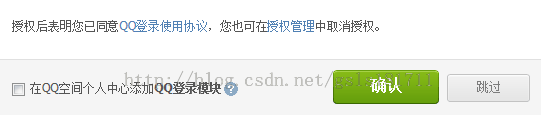

# 微信支付开发(1) JS API支付
 - http://www.cnblogs.com/txw1958/p/wxpayv3-jsapi.html
## 本文介绍微信支付下的jsapi实现流程
## 流程实现
### 1. OAuth2.0授权
 - 1、什么是OAuth2.0授权？(http://justcoding.iteye.com/blog/1950270)
    - 一、什么是OAuth协议
    OAuth(开放授权)是一个开放标准。
    允许第三方网站在用户授权的前提下访问在用户在服务商那里存储的各种信息。
    而这种授权无需将用户提供用户名和密码提供给该第三方网站。
    OAuth允许用户提供一个令牌给第三方网站，一个令牌对应一个特定的第三方网站，同时该令牌只能在特定的时间内访问特定的资源。
    - 二、OAuth的原理和授权流程
      OAuth的认证和授权的过程中涉及的三方包括：
      服务商：用户使用服务的提供方，一般用来存消息、储照片、视频、联系人、文件等(比如Twitter、Sina微波等)。
      用  户：服务商的用户
      第三方：通常是网站，该网站想要访问用户存储在服务商那里的信息。
      比如某个提供照片打印服务的网站，用户想在那里打印自己存在服务商那里的网络相册。
      在认证过程之前，第三方需要先向服务商申请第三方服务的唯一标识。
      OAuth认证和授权的过程如下:
      1、用户访问第三方网站网站，想对用户存放在服务商的某些资源进行操作。
      2、第三方网站向服务商请求一个临时令牌。
      3、服务商验证第三方网站的身份后，授予一个临时令牌。
      4、第三方网站获得临时令牌后，将用户导向至服务商的授权页面请求用户授权，然后这个过程中将临时令牌和第三方网站的返回地址发送给服务商。
      5、用户在服务商的授权页面上输入自己的用户名和密码，授权第三方网站访问所相应的资源。
      6、授权成功后，服务商将用户导向第三方网站的返回地址。
      7、第三方网站根据临时令牌从服务商那里获取访问令牌。
      8、服务商根据令牌和用户的授权情况授予第三方网站访问令牌。
      9、第三方网站使用获取到的访问令牌访问存放在服务商的对应的用户资源。
    - 三、目前支持OAuth的网站有哪些？
       t.sina.com.cn
       t.qq.com
       t.sohu.com
       t.163.com
       www.douban.com
       www.twitter.com
       www.facebook.com
       Google Buzz
       
 - 所谓OAuth（即Open Authorization，开放授权），它是为用户资源授权提供了一种安全简单的标准，也就是说用户在访问第三方web或应用的时候，第三方不会知道用户的信息（登录密码等），现在基本都支持OAuth2.0版本了。
   首先来看看我们在第三方使用oauth流程如下：
   第一步：用户登录第三方网站，使用qq登录。
   
   第二步：点击登录后，会跳到qq平台提示输入用户名和密码。
    
   第三步：如果用户名和密码正确，会提示是否接受授权，如果授权成功，第三方网站就能访问你的资源了，qq头像、用户名等
    
   认证和授权过程（包括三方）
   　　1、服务提供方，用户使用服务提供方来存储受保护的资源，如照片，视频，联系人列表。     
   　　2、用户，存放在服务提供方的受保护的资源的拥有者。
   　　3、客户端，要访问服务提供方资源的第三方应用，通常是网站。在认证过程之前，客户端要向服务提供者申请客户端标识。
            
          用户访问客户端的网站，想操作用户存放在服务提供方的资源。
   
   　　客户端向服务提供方请求一个临时令牌。
   　　服务提供方验证客户端的身份后，授予一个临时令牌。
   　　客户端获得临时令牌后，将用户引导至服务提供方的授权页面请求用户授权。在这个过程中将临时令牌和客户端的回调连接发送给服务提供方。
   　　用户在服务提供方的网页上输入用户名和密码，然后授权该客户端访问所请求的资源。
   　　授权成功后，服务提供方引导用户返回客户端的网页，并返回已授权的临时凭证。
   　　客户端根据已授权的临时令牌从服务提供方那里获取访问令牌。
   　　服务提供方根据临时令牌和用户的授权情况授予客户端访问令牌。
   　　客户端使用获取的访问令牌访问该用户存放在服务提供方上的受保护的资源。（客户端只能访问给予它授权的用户的资源信息）
   
 -  2、授权流程及操作
    - JSAPI 支付前需要调用 登录授权接口获取到用户的 Openid 。所以需要做一次授权，这次授权是不弹出确认框的。
    其实质就是在用户访问
    <pre>
         http://www.fangbei.org/wxpay/js_api_call.php
    </pre>
 - 时跳转到
    <pre>
          https://open.weixin.qq.com/connect/oauth2/authorize?appid=wx8888888888888888&redirect_uri=http://www.fangbei.org/wxpay/js_api_call.php&response_type=code&scope=snsapi_base&state=STATE#wechat_redirect
    </pre>
 - 以此来获得code参数，并根据code来获得授权access_token及openid其实现的详细流程可参考 微信公众平台开发（71）OAuth2.0网页授权(http://www.cnblogs.com/txw1958/p/weixin71-oauth20.html)
   在微信支付的Demo中，其代码为
   <pre>
       //使用jsapi接口
       $jsApi = new JsApi_pub();
       
       //=========步骤1：网页授权获取用户openid============
       //通过code获得openid
       if (!isset($_GET['code']))
       {
           //触发微信返回code码
           $url = $jsApi->createOauthUrlForCode(WxPayConf_pub::JS_API_CALL_URL);
           Header("Location: $url"); 
       }else
       {
           //获取code码，以获取openid
           $code = $_GET['code'];
           $jsApi->setCode($code);
           $openid = $jsApi->getOpenId();
       }
   </pre>
 - 这一步的最终结果就是获得了当前用户的openid
 <pre>
        ou9dHt0L8qFLI1foP-kj5x1mDWsM
 </pre>
## 2. 统一支付
 - 统一支付是JSAPI/NATIVE/APP各种支付场景下生成支付订单，返回预支付订单号的接口，目前微信支付所有场景均使用这一接口
   统一支付中以下参数从配置中获取，或由类自动生成，不需要用户填写
   <pre>
         $this->parameters["appid"] = WxPayConf_pub::APPID;//公众账号ID
         $this->parameters["mch_id"] = WxPayConf_pub::MCHID;//商户号
         $this->parameters["spbill_create_ip"] = $_SERVER['REMOTE_ADDR'];//终端ip        
         $this->parameters["nonce_str"] = $this->createNoncestr();//随机字符串
         $this->parameters["sign"] = $this->getSign($this->parameters);//签名
   </pre>
 - 在JSAPI支付中，另外填写以下参数\
  <pre>
          //统一支付接口中，trade_type为JSAPI时，openid为必填参数！
          $unifiedOrder->setParameter("openid","$openid");//商品描述
          $unifiedOrder->setParameter("body","方倍工作室");//商品描述
          //自定义订单号，此处仅作举例
          $timeStamp = time();
          $out_trade_no = WxPayConf_pub::APPID."$timeStamp";
          $unifiedOrder->setParameter("out_trade_no","$out_trade_no");//商户订单号 
          $unifiedOrder->setParameter("total_fee","1");//总金额
          $unifiedOrder->setParameter("notify_url",WxPayConf_pub::NOTIFY_URL);//通知地址 
          $unifiedOrder->setParameter("trade_type","JSAPI");//交易类型
    </pre>
  - 其他为选填参数
  <pre>
           //非必填参数，商户可根据实际情况选填
           //$unifiedOrder->setParameter("sub_mch_id","XXXX");//子商户号  
           //$unifiedOrder->setParameter("device_info","XXXX");//设备号 
           //$unifiedOrder->setParameter("attach","XXXX");//附加数据 
           //$unifiedOrder->setParameter("time_start","XXXX");//交易起始时间
           //$unifiedOrder->setParameter("time_expire","XXXX");//交易结束时间 
           //$unifiedOrder->setParameter("goods_tag","XXXX");//商品标记 
           //$unifiedOrder->setParameter("openid","XXXX");//用户标识
           //$unifiedOrder->setParameter("product_id","XXXX");//商品ID
      </pre>
  - 这些参数最终组成了这样的xml数据，
      <pre>
            <xml>
              <openid><![CDATA[ou9dHt0L8qFLI1foP-kj5x1mDWsM]]></openid>
              <body><![CDATA[方倍工作室]]></body>
              <out_trade_no><![CDATA[wx88888888888888881414411779]]></out_trade_no>
              <total_fee>1</total_fee>
              <notify_url><![CDATA[http://www.fangbei.org/wxpay/notify_url.php]]></notify_url>
              <trade_type><![CDATA[JSAPI]]></trade_type>
              <appid><![CDATA[wx8888888888888888]]></appid>
              <mch_id>10012345</mch_id>
              <spbill_create_ip><![CDATA[61.50.221.43]]></spbill_create_ip>
              <nonce_str><![CDATA[60uf9sh6nmppr9azveb2bn7arhy79izk]]></nonce_str>
              <sign><![CDATA[2D8A96553672D56BB2908CE4B0A23D0F]]></sign>
            </xml>
      </pre>
  -  将这些数据提交给统一支付接口
    <pre>
        https://api.mch.weixin.qq.com/pay/unifiedorder
    </pre>
  - 将获得返回 如下数据
      <pre>
            <xml>
              <return_code><![CDATA[SUCCESS]]></return_code>  
              <return_msg><![CDATA[OK]]></return_msg>  
              <appid><![CDATA[wx8888888888888888]]></appid>  
              <mch_id><![CDATA[10012345]]></mch_id>  
              <nonce_str><![CDATA[Be8YX7gjCdtCT7cr]]></nonce_str>  
              <sign><![CDATA[885B6D84635AE6C020EF753A00C8EEDB]]></sign>  
              <result_code><![CDATA[SUCCESS]]></result_code>  
              <prepay_id><![CDATA[wx201410272009395522657a690389285100]]></prepay_id>  
              <trade_type><![CDATA[JSAPI]]></trade_type> 
            </xml>
      </pre>
  - 其中包含了最重要的预支付ID参数，prepay_id，值为 
  <pre>
        wx201410272009395522657a690389285100
  </pre>
## 3、JS API支付
  - 前面的准备工作做好了以后，JS API根据prepay_id生成jsapi支付参数
    生成代码如下
    <pre>
            //=========步骤3：使用jsapi调起支付============
            $jsApi->setPrepayId($prepay_id);
            $jsApiParameters = $jsApi->getParameters();
    </pre>
  - 生成的json数据如下
    <pre>
            {
                "appId": "wx8888888888888888",
                "timeStamp": "1414411784",
                "nonceStr": "gbwr71b5no6q6ne18c8up1u7l7he2y75",
                "package": "prepay_id=wx201410272009395522657a690389285100",
                "signType": "MD5",
                "paySign": "9C6747193720F851EB876299D59F6C7D"
            }
    </pre>
  - 在微信浏览器中调试起js接口，代码如下
    
            <html>
            <head>
                <meta http-equiv="content-type" content="text/html;charset=utf-8"/>
                <title>微信安全支付</title>
                
            </head>
            <body>
                    
                

                    <button style="width:210px; height:30px; background-color:#FE6714; border:0px #FE6714 solid; cursor: pointer;  color:white;  font-size:16px;" type="button" onclick="callpay()" >贡献一下</button>
                

            </body>
            </html>
    
  - 当用户点击“贡献一下”按钮时，将弹出微信支付插件，用户可以开始支付。
## 4、支付通知
 - 支付成功后，通知接口中也将收到支付成功的xml通知
    <pre>
            <xml>
              <appid><![CDATA[wx8888888888888888]]></appid>  
              <bank_type><![CDATA[CFT]]></bank_type>  
              <fee_type><![CDATA[CNY]]></fee_type>  
              <is_subscribe><![CDATA[Y]]></is_subscribe>  
              <mch_id><![CDATA[10012345]]></mch_id>  
              <nonce_str><![CDATA[60uf9sh6nmppr9azveb2bn7arhy79izk]]></nonce_str>  
              <openid><![CDATA[ou9dHt0L8qFLI1foP-kj5x1mDWsM]]></openid>  
              <out_trade_no><![CDATA[wx88888888888888881414411779]]></out_trade_no>  
              <result_code><![CDATA[SUCCESS]]></result_code>  
              <return_code><![CDATA[SUCCESS]]></return_code>  
              <sign><![CDATA[0C1D7F2534F1473247550A5A138F0CEB]]></sign>  
              <sub_mch_id><![CDATA[10012345]]></sub_mch_id>  
              <time_end><![CDATA[20141027200958]]></time_end>  
              <total_fee>1</total_fee>  
              <trade_type><![CDATA[JSAPI]]></trade_type>  
              <transaction_id><![CDATA[1002750185201410270005514026]]></transaction_id> 
            </xml>
    </pre>
 
 
## nodejs支付宝支付流程
  - （http://neutra.github.io/2013/%E6%94%AF%E4%BB%98%E5%AE%9DWAP%E6%94%AF%E4%BB%98%E6%8E%A5%E5%8F%A3%E5%BC%80%E5%8F%91/）
     
  - 1、用户点击购买按钮，想网站发起购买请求
  - 2、网站创建订单，指派一个唯一的订单号
  - 3、网站把订单号、企业支付宝账号、交易金额、数量等信息，用私钥签名发送给支付宝
  - 4、支付宝创建一个交易订单，返回一个交易令牌（token）
  - 5、网站按照指定要求，用token和自己的私钥，构造一个重定向得到支付地址
  - 6、网站把重定向的地址返回给浏览器
  - 7、浏览器自动重定向到该地址，既包含了token、网站签名的支付宝交易页面
  - 8、支付宝显示当前的交易金额、数量、卖家信息
  - 9、用户用自己的支付宝账号支付这比金额
  - 10、支付宝把用户支付成功（或失败）这个消息和订单上加上支付宝签名，使用http post的方式通知网站（失败的话，会隔段时间重新发送）
  - 11、网站处理交易后续逻辑（发货、订单状态储蓄之类的）
  - 12、网站返回‘success’字符串给支付宝，表示该通知已经处理，不用再重新发送
  - 13、支付宝显示支付成功的页面给用户（这一步和第10步是不分先后发生的）
  - 14、支付成功页面延迟自动跳转，或用户点击‘返回商品页面’，跳转到页面的支付结束页面（此时不一定成功处理支付宝发来的通知），但会在url中带上当前的订单号和状态
  
### 可以发现，整个流程有点像oAuth，主要有三部：
  - 一是申请支付宝交易号（获取token），这一步可以理解，让支付宝验证网站的有效性、让网站指定交易要支付多少钱 
  - 二是用户到支付宝页面付款，这一步可以理解为支付宝验证用户的有效性，让用户在一个不受网站监视的环境下进行支付，
  - 三是用户付款后，处理结果告诉用户支付成功（同步通知），另外异步通知网站服务器该订单已经支付
### 支付宝的接口
  - 文档中说只有两个步骤，
 
 
 
 
 
 
 
 
 
 
 
 
 
 
 
 
 
 
 
 
 
 
 
 
 
 
 
 
 